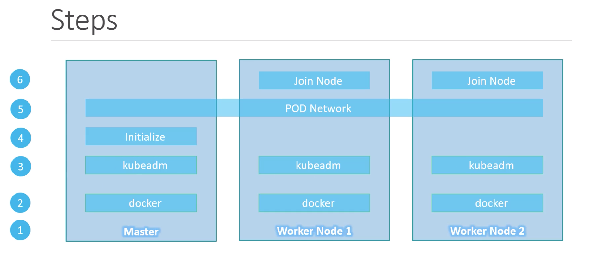
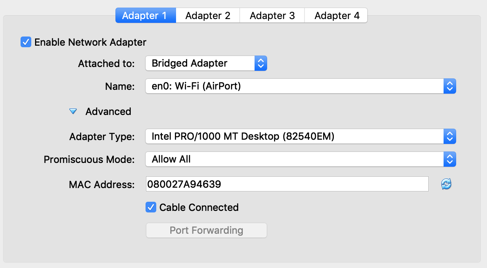
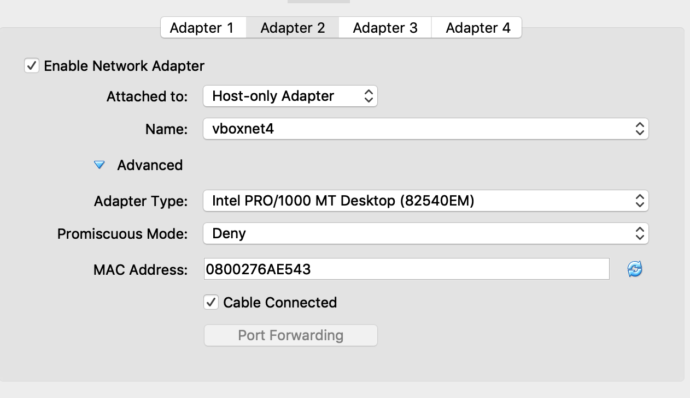
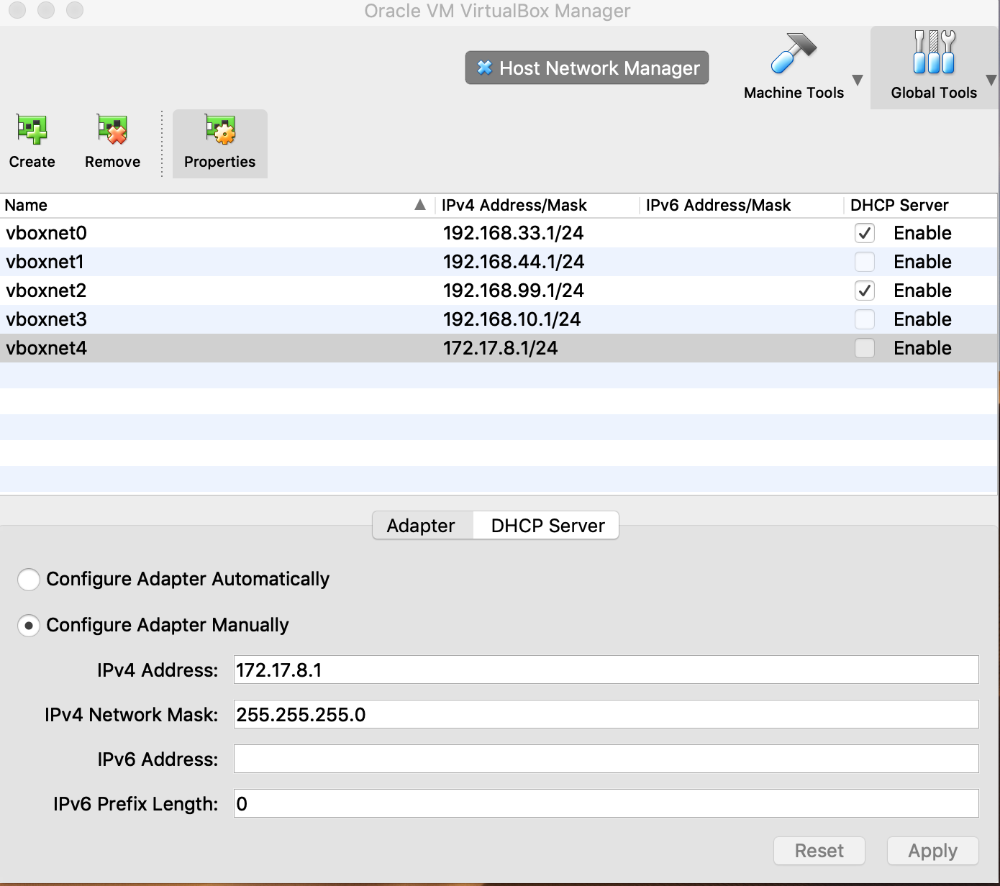

# Big Picture
 

## Assumptions

|Role|FQDN|IP|OS|RAM|CPU|
|----|----|----|----|----|----|
|Master1|kubemaster1|172.17.8.101|Ubuntu 16|2G|2|
|Node1|kubenode1|172.17.8.201|Ubuntu 16|1G|1|
|Node2|kubenode2|172.17.8.202|Ubuntu 16|1G|1|


# Provision

Download image : https://sourceforge.net/projects/osboxes/files/v/vb/55-U-u/16.04/16.04.6/1604.664.7z/download


# On both Kmaster and Kworker
## Pre-requisites 
Set net adapter all VM as image below

 

 

 


#### Edit Hostname file
```
# kube-master1 /ect/hostname
kubemaster1
```

```
# kubenode1 /ect/hostname
kubenode1
```

```
# kubenode2 /ect/hostname
kubenode2
```

#### Edit `/etc/hosts` file

```
# kube-master1 /ect/hostname
127.0.0.1 kubemaster1
```

```
# kubenode1 /ect/hostname
127.0.0.1 kubenode1
```

```
# kubenode2 /ect/hostname
127.0.0.1 kubenode2
```

#### Edit `/etc/network/interfaces`
```
# Configur enp0s8 interface
auto enp0s8
iface enp0s8 inet static
      address 172.17.8.{assigned IP}
      netmark 255.255.255.0
```


## Disable swap
```
swapoff -a
```
exit `/etc/fstab` file. commit out swap line.
```
#UUID=dec25862-42c7-4494-8f75-e6cc76aa65ea none            swap    sw$
```

# Set up Kubernetes Cluster

[set up reference document](https://kubernetes.io/docs/setup/production-environment/tools/kubeadm/install-kubeadm/) 


#### Install Docker
```
apt-get update -y
apt-get install -y docker.io
```

#### Installing kubeadm, kubelet and kubectl
```
apt-get update && apt-get install -y apt-transport-https curl
```

```
curl -s https://packages.cloud.google.com/apt/doc/apt-key.gpg | apt-key add -
```

```
cat <<EOF >/etc/apt/sources.list.d/kubernetes.list
deb https://apt.kubernetes.io/ kubernetes-xenial main
EOF
apt-get update


```

```
apt-get install -y kubelet kubeadm kubectl
apt-mark hold kubelet kubeadm kubectl

```


# Initializing your control-plane node
use Calico network template.
```
kubeadm init --pod-network-cidr=192.168.0.0/16 --apiserver-advertise-address=172.17.8.101
```

```
kubeadm join 172.17.8.101:6443 --token dub30w.o0of5avs3dy0i0nw \
    --discovery-token-ca-cert-hash sha256:bb0c544f4bd39d497f39c6ea223950bb2f7fbc096cbdd4e5eaef5971de861493

```

Root User
```
export KUBECONFIG=/etc/kubernetes/admin.conf

```
Normal user
```
exit
mkdir -p $HOME/.kube
sudo cp -i /etc/kubernetes/admin.conf $HOME/.kube/config
sudo chown $(id -u):$(id -g) $HOME/.kube/config
```


### Install pod network for external communication
```
kubectl apply -f https://docs.projectcalico.org/v3.8/manifests/calico.yaml

```

#### check POD
```
kubectl get pods --all-namespaces
```

#### Run join cluster on node1 and node2
```
kubeadm join 172.17.8.101:6443 --token dub30w.o0of5avs3dy0i0nw \
    --discovery-token-ca-cert-hash sha256:bb0c544f4bd39d497f39c6ea223950bb2f7fbc096cbdd4e5eaef5971de861493

```

#### test run pod
```
kubectl run nginx --image=nginx
```
```
kubectl get pods
```
