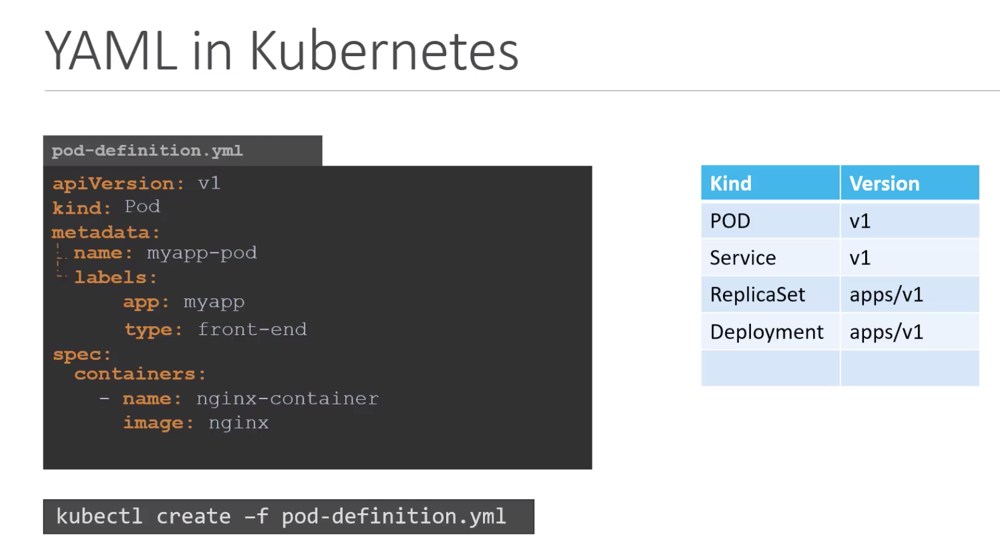

# Structure


 
```yaml
apiVersion: v1
kind: Pod
metadata:
    name: myapp-pod
    labels:
        app: myapp
        type: front-end
spec:
    containers:
        - name: nginx-controller
          image: nginx
```
```
kubectl create -f pod-definition.yml
```

```
kubectl get pods
```

```
kubectl describe myapp-pod
```
